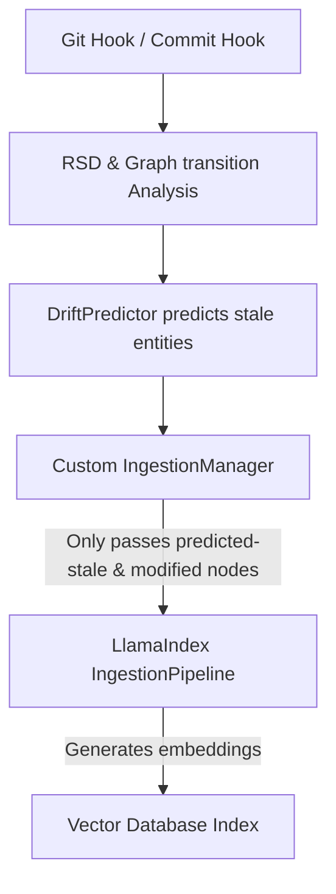

# Solution Proposal: Embedding Logic Overrides in Open-Source Pipelines

This proposal addresses the **Embedding Overriding Problem** by identifying suitable open-source target frameworks and designing a clean, non-intrusive integration strategy for our predictive re-embedding logic.

---

## 1. Candidate Frameworks

We have identified two primary classes of open-source projects where our re-embedding strategy can be integrated:

### Target A: LlamaIndex (Framework Level - Highly Recommended)
*   **What it is:** The leading data framework for LLM applications. It features advanced codebase chunking (`CodeSplitter`) and document management systems (`DocumentStore`).
*   **Why it fits:** LlamaIndex has a native `IngestionPipeline` that supports custom transformation steps, caching, and incremental indexing (`index.refresh_ref_docs`).
*   **How we override it:** By implementing a custom `TransformComponent` or wrapping their `BaseDocumentStore` to selectively mark dependent code chunks as "dirty" based on our predictive model.

### Target B: Sweep (Agent Level)
*   **What it is:** An open-source AI junior developer agent that automatically indexes GitHub codebases in a vector database to search and solve issues.
*   **Why it fits:** It is an end-to-end agent with a dedicated indexing service (`sweep_ai/services/codebase.py`) that chunks code files into functions/classes and stores them in Qdrant/Chroma.
*   **How we override it:** By replacing their standard file-level chunk-update loop with our call-graph aware re-embedding orchestrator.

---

## 2. Recommended Integration Architecture: LlamaIndex

Integrating at the framework level (LlamaIndex) is the most robust solution because it keeps our logic compatible with any application built on LlamaIndex (including code agents like Mentat or Cody).

### Interception Design

The integration uses a **decorator/wrapper pattern** around LlamaIndex's `IngestionPipeline` and `VectorStoreIndex`.



### Steps to Implement the Override

#### Step 1: Create a Custom Node Parser / Graph Mapper
We extend LlamaIndex's `NodeParser` to output nodes with metadata containing parent-child class and function relations, matching the entities produced by our `RepoParser`.

```python
from llama_index.core.node_parser import BaseNodeParser
from llama_index.core.schema import BaseNode

class CodeGraphNodeParser(BaseNodeParser):
    def _parse_nodes(self, nodes: list[BaseNode], show_progress: bool = False) -> list[BaseNode]:
        # 1. Run RepoParser to build the DiGraph
        # 2. Extract AST functions and classes
        # 3. Attach graph relationship IDs (caller/callee) as metadata on LlamaIndex nodes
        return nodes
```

#### Step 2: Implement the Predictive Cache Invalidation Filter
Instead of passing the entire codebase to the indexer, we intercept the document list during updates. We use a custom `Docstore` wrapper or a pipeline pre-filter:

```python
class PredictiveCacheFilter:
    def __init__(self, predictor, repo_path):
        self.predictor = predictor
        
    def get_dirty_nodes(self, commit_a: str, commit_b: str, all_nodes: list[BaseNode]) -> set[str]:
        # 1. Extract Git diff and graph structure
        # 2. Run DriftPredictor to find directly modified & predicted stale nodes
        # 3. Return the specific node IDs that need re-embedding
        return dirty_node_ids
```

#### Step 3: Override the Index Refresh Flow
When a new commit is pushed, rather than calling the standard `index.refresh_ref_docs()` (which only detects file-level changes), we run:

```python
def predictive_refresh_index(index, commit_a: str, commit_b: str, all_nodes: list[BaseNode]):
    filter_engine = PredictiveCacheFilter(my_predictor, "/path/to/repo")
    
    # 1. Predict which nodes need re-embedding
    dirty_node_ids = filter_engine.get_dirty_nodes(commit_a, commit_b, all_nodes)
    
    # 2. Retrieve the actual nodes matching those IDs
    nodes_to_reembed = [n for n in all_nodes if n.id_ in dirty_node_ids]
    
    # 3. Overwrite only these nodes in the Vector Store
    index.insert_nodes(nodes_to_reembed)
    
    # 4. Remove any deleted nodes from the Vector Store index
```

---

## 3. Compatibility and Risk Assessment

*   **Zero-change to Vector Stores:** Since the override happens in the ingestion/filtering layer (before embeddings are sent to the vector store), it is 100% compatible with any vector database (Chroma, Qdrant, Pinecone, PGVector).
*   **Graceful Fallback:** If our `DriftPredictor` fails or is missing historical features (e.g. on the first commit), the system falls back to LlamaIndex's default file-level incremental indexer without breaking the retrieval pipeline.
*   **Extensibility:** Because it operates on standard LlamaIndex `BaseNode` schema objects, it can easily support languages other than Python if code graph parsers (like tree-sitter) are provided.
