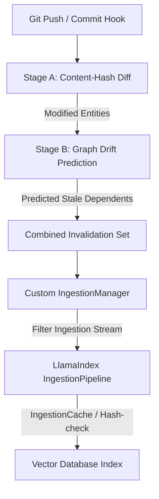

# Solution Proposal: Embedding Logic Overrides in LlamaIndex

This proposal addresses the **Embedding Overriding Problem** by detailing how our predictive semantic cache invalidation strategy can be integrated cleanly into LlamaIndex's ingestion and indexing pipeline. 

By targeting LlamaIndex, the solution remains highly modular and fully compatible with any downstream coding assistant or agent (such as Mentat, Cody, or custom agents) built on top of the LlamaIndex ecosystem.

---

## 1. Interception Architecture

The core integration principle is **non-intrusive interception**: instead of modifying vector databases directly, we intercept the ingestion stream *before* it gets sent to the embedding model or vector database. The `DriftPredictor` acts as a **pre-filter** that determines which codebase nodes need to be processed by the LlamaIndex `IngestionPipeline`.



---

## 2. Two-Stage Staleness Detection

To ensure correct invalidation behavior and facilitate metric tracking, the invalidation process is split into two distinct stages:

### Stage A: Content-Hash Diff (Deterministic & Cheap)
*   **Purpose:** Identify nodes that have definitely changed syntactically.
*   **Mechanism:** Compare the local files against the LlamaIndex `Docstore` using content hashes. Any node whose content hash has changed (or which has been added/removed) is marked as directly modified.
*   **Cost:** $O(1)$ lookup per node in the document store.

### Stage B: Dependency Propagation (Probabilistic & Graph-Aware)
*   **Purpose:** Identify callers/dependents that have become semantically outdated because their underlying dependencies changed.
*   **Mechanism:** Using the directly modified nodes from Stage A as the seed set, we traverse the call graph backward (upstream). The `DriftPredictor` runs on this candidate set of callers to predict which nodes exceed the semantic drift threshold.
*   **Cost:** Proportional to the size of the calling subgraph, avoiding a full codebase sweep.

### Failure Modes and Metrics to Track
By separating these stages, we can measure and optimize for two key risks:
*   **Over-invalidation (False Positives):** Re-embedding nodes that did not actually drift. Metric: *Update Overhead %* (percentage of unchanged nodes re-embedded).
*   **Stale Cache Misses (False Negatives):** Keeping outdated caller embeddings in the cache. Metric: *Retrieval Recall Degradation* compared to full reindexing.

---

## 3. Implementation Steps in LlamaIndex

### Step 1: Stable Node ID Generation
To ensure diff calculations work across commits, node IDs must not rely on AST indices or line numbers. 
*   **Standard:** Node IDs are generated using stable, fully-qualified identifiers:
    `relative_file_path::ClassName.method_name` or `relative_file_path::function_name`.
*   **Metadata:** Line bounds and content hashes are stored strictly inside the `metadata` dictionary of the `BaseNode` rather than part of the ID.

### Step 2: Custom Node Parser with Graph Relationships
We subclass LlamaIndex's `BaseNodeParser` to extract code entities and caller/callee relations, mirroring the call-graph output of `RepoParser`:

```python
from llama_index.core.node_parser import BaseNodeParser
from llama_index.core.schema import BaseNode

class CodeGraphNodeParser(BaseNodeParser):
    def _parse_nodes(self, nodes: list[BaseNode], show_progress: bool = False) -> list[BaseNode]:
        # 1. Run parser on the code files to extract entities
        # 2. Extract dependencies (calls, imports)
        # 3. Add relation mapping to node metadata:
        #    node.metadata["dependencies"] = [list of callee IDs]
        return nodes
```

### Step 3: Integrating the Ingestion Pipeline Interception
Rather than calling `index.insert_nodes()` directly and bypassing the caching/upsert layer, we feed the calculated invalidation set back into LlamaIndex's `IngestionPipeline`:

```python
from llama_index.core.ingestion import IngestionPipeline

def predictive_index_refresh(index, commit_a: str, commit_b: str, updated_documents):
    # 1. Run Stage A (Content-Hash Diff) to find directly modified nodes
    # 2. Run Stage B (Drift Predictor) to find predicted stale callers
    invalidated_node_ids = run_two_stage_staleness_detection(commit_a, commit_b)
    
    # 3. Retrieve the full Node objects from the updated documents
    nodes_to_process = get_nodes_by_ids(updated_documents, invalidated_node_ids)
    
    # 4. Route nodes through the standard IngestionPipeline
    # This preserves duplicate/upsert checks, docstore sync, and IngestionCache
    pipeline = IngestionPipeline(
        transformations=[CodeGraphNodeParser(), MyEmbeddingModel()],
        docstore=index.docstore,
        vector_store=index.vector_store,
        cache=my_ingestion_cache
    )
    
    # Run the pipeline solely on the invalidated subset
    pipeline.run(documents=nodes_to_process)
```

---

## 4. Deletion and Graph Maintenance

### Handling Deletions
When a function or class is deleted:
1.  **Incoming Caller Resolution:** We query the dependency graph for all nodes that called the deleted symbol.
2.  **Staleness Promotion:** These callers are added to the Stage B candidate set and evaluated by `DriftPredictor` (since calling a deleted function will cause compiler errors or semantic drift in the caller).
3.  **Docstore Cleanup:** The deleted nodes are removed from the vector database index via LlamaIndex's standard `docstore.delete_ref_doc` flow.

### Optimization: Incremental Graph Updates
Rebuilding the call-graph from scratch on every commit can become a bottleneck for large codebases. 
*   **Optimization Vector:** Instead of running `RepoParser` globally, we only parse the files modified in the Git diff. We remove the old graph nodes and edges belonging to those modified files, parse the new ASTs, and patch the call graph incrementally.
