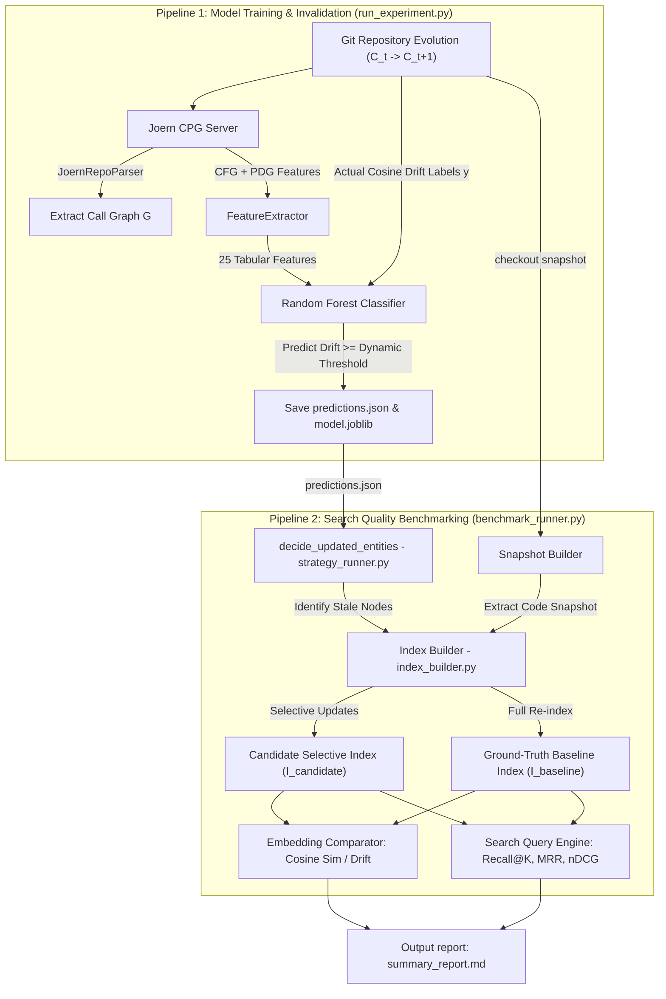

# Predictive Semantic Cache Invalidation - Pipeline Run-Book

This document provides a detailed setup and execution guide for the **Predictive Semantic Cache Invalidation** pipeline and the standalone **Retrieval Quality Benchmarking** pipeline.

---

## 1. Overall System Architecture & Workflow

Here is the complete end-to-end data flow showing how both pipelines interact:



---

## 2. Environment Setup

### 2.1 Python Virtual Environment
Initialize and configure your Python dependencies:

```powershell
# Create virtual environment
python -m venv venv

# Activate virtual environment
./venv/Scripts/Activate.ps1

# Install requirements
pip install -r requirements.txt
```

### 2.2 Joern Code Property Graph Server
If running in Joern mode (`joern_hybrid` or `joern_only`), you must have Joern installed on your system path and start the local CPG query server:

```powershell
# Starts the Joern CPGQL query server on localhost:8080 (in a separate terminal)
joern --server 
```
Running for a configurable port
```powershell
# Starts the Joern CPGQL query server on localhost:<port-number> (in a separate terminal)
joern --server --server-port <port-number>
```

Run the joern server on a manually configured port 8081
```powershell
# Starts the Joern CPGQL query server on localhost:8081 (in a separate terminal)
joern --server --server-port 8081
```

---

## 3. Pipeline 1: Model Training & Drift Prediction (`run_experiment.py`)

This pipeline replays Git history, extracts features, calculates actual embedding cosine drift, and trains a Random Forest model to predict future stale cache nodes.

### 3.1 CLI Arguments Reference
*   `--config`: Path to a JSON configuration file (e.g. `config.example.json`). If provided, command line arguments override settings loaded from this file.
*   `--repo-url`: Git repository URL to clone (default: `https://github.com/psf/black.git`).
*   `--workspace-dir`: Workspace directory name (default: `workspace`).
*   `--num-commits`: Number of commits to process in the train-test sequence.
*   `--commit-stride`: Step size between processed commits.
*   `--parser-mode`: Repository parsing strategy:
    *   `ast`: Direct Python AST nodes (default).
    *   `joern_hybrid`: AST for dependency graphs, Joern server for CPG feature harvesting.
    *   `joern_only`: Pure Joern CPG construction and call graph extraction.
*   `--model-name`: Name of the SentenceTransformer model (e.g. `sentence-transformers/all-MiniLM-L6-v2` or `microsoft/unixcoder-base`).
*   `--threshold`: The drift threshold above which an entity is marked as "stale" (default: `0.02`).

### 3.2 Running the Pipeline

#### A. Standard Python AST Parsing (No Joern Required)
```powershell
./venv/Scripts/python.exe run_experiment.py --parser-mode ast --num-commits 30 --model-name sentence-transformers/all-MiniLM-L6-v2
```

#### B. Joern-Backed Hybrid Mode
```powershell
# Joern server must be running at localhost:8080
./venv/Scripts/python.exe run_experiment.py --parser-mode joern_hybrid --num-commits 15 --model-name sentence-transformers/all-MiniLM-L6-v2
```

#### C. Using a Configuration JSON File
```powershell
./venv/Scripts/python.exe run_experiment.py --config config.example.json
```

### 3.3 Output Artifacts
The training run outputs:
*   `predictions.json`: A mapping of entity IDs to boolean predictions (`true` = stale, re-embed; `false` = fresh, reuse cache).
*   `results/`: Directory containing performance plots, trained model weight files (`model.joblib`), and training logs.

---

## 4. Pipeline 2: Standalone Search Quality Benchmarking (`benchmark_runner.py`)

This pipeline runs search queries against the selective vector index (built using predictions from Pipeline 1) and compares search ranking degradation against a ground-truth baseline re-index.

### 4.1 CLI Arguments Reference

| Argument | Default | Description |
|---|---|---|
| `--config` | — | Path to JSON benchmarking config. CLI args override it. |
| `--repo-url` | `https://github.com/psf/black.git` | Repository to clone if `--repo-path` does not exist. |
| `--repo-path` | `workspace/black` | Path to the local git checkout folder. |
| `--output-dir` | `benchmark_runs` | Base folder to store evaluation results. |
| `--num-commits` | `10` | Number of commit snapshots to evaluate. |
| `--commit-stride` | `1` | Step size between evaluated commits. |
| `--sampling-mode` | `adjacent` | Commit pair selection: `adjacent`, `stride`, or `manual`. |
| `--strategies` | `changed_only,fixed_hop,predictive_ml,full_reindex` | Comma-separated invalidation strategies. |
| `--query-mode` | `hybrid` | Query source: `synthetic`, `curated`, or `hybrid`. |
| `--curated-queries-path` | `src/benchmarking/data/curated_queries.json` | Path to hand-authored curated queries JSON or CSV. |
| `--predictions-path` | — | Path to `predictions.json` from Pipeline 1 `{entity_id: float}`. Required for `predictive_ml`. |
| `--model-name` | `sentence-transformers/all-MiniLM-L6-v2` | SentenceTransformer embedding model. |
| `--parser-mode` | `tree_sitter` | Repository parser: `tree_sitter` or `ast`. |
| `--hop-k` | `2` | Hop depth for `fixed_hop` strategy propagation. |
| `--ml-threshold` | `0.5` | Score threshold for binarising continuous ML drift scores in `predictive_ml`. |
| `--n-seeds` | `1` | Independent benchmark seeds. Set `> 1` to get mean +/- std aggregated report. |
| `--max-queries-per-entity` | `2` | Max synthetic queries generated per entity. |
| `--compare-embeddings` | `True` | Perform direct cosine-similarity comparison between baseline and candidate vectors. |

**Invalidation strategies:**

| Strategy | What it updates | Cost |
|---|---|---|
| `changed_only` | Entities in files directly touched by the git diff | Lowest |
| `fixed_hop` | Changed entities + callers up to `--hop-k` hops in the call graph | Low–medium |
| `predictive_ml` | Entities whose ML drift score >= `--ml-threshold` (requires `--predictions-path`) | Medium |
| `full_reindex` | Every entity in the snapshot (oracle upper bound) | Highest |

---

### 4.2 Running the Benchmark

#### A. Minimal run — all four strategies, hybrid query mode (recommended default)
```powershell
./venv/Scripts/python.exe benchmark_runner.py --repo-path workspace/black --num-commits 5
```
Uses all defaults: 4 strategies (`changed_only`, `fixed_hop`, `predictive_ml`, `full_reindex`),
`hybrid` query mode, curated queries from `src/benchmarking/data/curated_queries.json`.

---

#### B. Full run with ML predictions from Pipeline 1
```powershell
./venv/Scripts/python.exe benchmark_runner.py `
    --repo-path workspace/black `
    --num-commits 10 `
    --strategies changed_only,fixed_hop,predictive_ml,full_reindex `
    --predictions-path results/<run_dir>/predictions.json `
    --query-mode hybrid `
    --hop-k 2 `
    --ml-threshold 0.5
```

---

#### C. Curated-only queries (most rigorous — eliminates synthetic self-reference risk)
```powershell
./venv/Scripts/python.exe benchmark_runner.py `
    --repo-path workspace/black `
    --num-commits 10 `
    --query-mode curated `
    --curated-queries-path src/benchmarking/data/curated_queries.json
```

---

#### D. Multi-seed run for statistically aggregated mean +/- std results
```powershell
./venv/Scripts/python.exe benchmark_runner.py `
    --repo-path workspace/black `
    --num-commits 10 `
    --n-seeds 5 `
    --query-mode hybrid
```
Produces `benchmark_runs/aggregated_report.md` with mean +/- std per metric across 5 seeds.

---

#### E. Tuning hop depth for fixed_hop
```powershell
./venv/Scripts/python.exe benchmark_runner.py `
    --repo-path workspace/black `
    --num-commits 10 `
    --strategies changed_only,fixed_hop,full_reindex `
    --hop-k 3 `
    --query-mode hybrid
```

---

#### F. Using a JSON configuration file
```powershell
./venv/Scripts/python.exe benchmark_runner.py --config benchmark_config.example.json
```

---

### 4.3 Output Artifacts

Artifacts are stored under `benchmark_runs/<run_id>/`:

| File | Description |
|---|---|
| `benchmark_config.json` | Active runtime configuration for reproducibility. |
| `commit_pairs.json` | List of commit pairs evaluated. |
| `queries.json` | All query cases used (synthetic + curated). |
| `per_query_results.jsonl` | Per-query results: baseline rank, selective rank, scores, deltas, freshness and cache-pass flags. |
| `summary_metrics.json` | Aggregated metrics including `strategy_summaries` and `saturation_warning` flag. |
| `summary_report.md` | Markdown report with Strategy Performance Table (95% Wilson CI columns), Cost vs. Quality Pareto Frontier table, and Direct Embedding Quality table. No `benchmark_passed` badge. |
| `aggregated_report.md` | *(Only when `--n-seeds > 1`)* Mean +/- std per metric across all seeds. |

---

### 4.4 Reading `summary_report.md`

**Strategy Performance Table** — Wilson 95% CI on freshness and cache-preservation rates:
```
| Strategy      | Update Cost | Freshness [95% CI] (n)          | Cache Pres. [95% CI] (n)        | MRR Delta | nDCG@10 Delta |
| changed_only  | 0.0800      | 0.600 [0.460-0.727] (n=50)      | 0.920 [0.813-0.970] (n=50)      | -0.1500   | -0.1500       |
| fixed_hop     | 0.2200      | 0.800 [0.663-0.893] (n=50)      | 0.850 [0.718-0.933] (n=50)      | -0.0800   | -0.0700       |
| predictive_ml | 0.1800      | 0.780 [0.641-0.879] (n=50)      | 0.880 [0.752-0.951] (n=50)      | -0.0500   | -0.0400       |
| full_reindex  | 1.0000      | 0.960 [0.860-0.991] (n=50)      | 0.700 [0.557-0.816] (n=50)      | +0.0000   | +0.0000       |
```

**Cost vs. Quality Pareto Frontier** — strategies that cannot be simultaneously improved on both cost and freshness:
```
| Strategy      | Update Cost | Freshness Rate | Pareto-Optimal |
| changed_only  | 0.0800      | 0.6000         | Yes            |
| predictive_ml | 0.1800      | 0.7800         | Yes            |
| fixed_hop     | 0.2200      | 0.8000         | Yes            |
| full_reindex  | 1.0000      | 0.9600         | Yes            |
```

> **Saturation warning:** A `BENCHMARK SATURATED` caution block appears at the top of the report if the saturation guard detects all strategies produce indistinguishable metrics despite differing update costs. This indicates the query set contains entity names (identity leak). Switch to `--query-mode=curated` to resolve it.

---

## 5. Verification Test Suite

Verify your installation and run the suite of unit/smoke tests:

```powershell
./venv/Scripts/python.exe -m unittest discover -s tests -p 'test_benchmark_*.py'
```

---

## 6. Advanced Integrations & Logging

### 6.1 AST Cosmetic Filter
To save API cost and clean up model training noise, the pipeline uses a node-level AST filter:
*   We compile code snippets into Abstract Syntax Trees using Python's `ast` module.
*   We compare `ast.dump(ast.parse(old_code))` against `ast.dump(ast.parse(new_code))`.
*   If they are identical, the edit was purely cosmetic (whitespaces, docstrings, or comments). The entity is automatically removed from `modified_entities` and does not trigger updates.

### 6.2 Commit-Pair Diagnostic Logging
Each commit transition $(C_t \rightarrow C_{t+1})$ produces a detailed diagnostic log file `results/<dir_name>/commit_logs/commit_from_<commit_a>_to_<commit_b>.json` containing:
1.  **`git_changes`**: Added, modified (semantic only), and removed entity IDs.
2.  **`dependency_graph`**: Full call graph topological nodes and edges at that commit state.
3.  **`features_matrix`**: The exact matrix of 25 features calculated for all entities in the repository.
4.  **`cosine_drifts`**: Ground-truth actual embedding drift values.
5.  **`invalidation_decisions`**: Model predictions and stale/fresh decisions.
6.  **`strategy_re_embeddings`**: Lists of entities re-embedded under all evaluated strategies (including `weighted_bfs_decay`).
7.  **`strategy_metrics`**: Evaluation search scores (Recall@K, MRR, nDCG) for each strategy.

