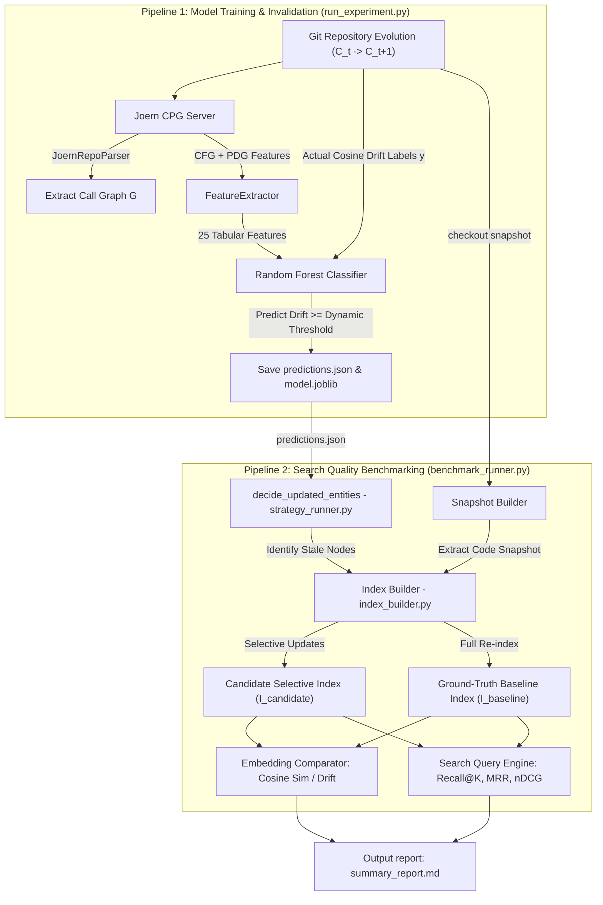

# Predictive Semantic Cache Invalidation - Pipeline Run-Book

This document provides a detailed setup and execution guide for the **Predictive Semantic Cache Invalidation** pipeline and the standalone **Retrieval Quality Benchmarking** pipeline.

---

## 1. Overall System Architecture & Workflow

Here is the complete end-to-end data flow showing how both pipelines interact:



---

## 2. Environment Setup

### 2.1 Python Virtual Environment
Initialize and configure your Python dependencies:

```powershell
# Create virtual environment
python -m venv venv

# Activate virtual environment
./venv/Scripts/Activate.ps1

# Install requirements
pip install -r requirements.txt
```

### 2.2 Joern Code Property Graph Server
If running in Joern mode (`joern_hybrid` or `joern_only`), you must have Joern installed on your system path and start the local CPG query server:

```powershell
# Starts the Joern CPGQL query server on localhost:8080 (in a separate terminal)
joern --server 
```
Running for a configurable port
```powershell
# Starts the Joern CPGQL query server on localhost:<port-number> (in a separate terminal)
joern --server --server-port <port-number>
```

Run the joern server on a manually configured port 8081
```powershell
# Starts the Joern CPGQL query server on localhost:8081 (in a separate terminal)
joern --server --server-port 8081
```

---

## 3. Pipeline 1: Model Training & Drift Prediction (`run_experiment.py`)

This pipeline replays Git history, extracts features, calculates actual embedding cosine drift, and trains a Random Forest model to predict future stale cache nodes.

### 3.1 CLI Arguments Reference
*   `--config`: Path to a JSON configuration file (e.g. `config.example.json`). If provided, command line arguments override settings loaded from this file.
*   `--repo-url`: Git repository URL to clone (default: `https://github.com/psf/black.git`).
*   `--workspace-dir`: Workspace directory name (default: `workspace`).
*   `--num-commits`: Number of commits to process in the train-test sequence.
*   `--commit-stride`: Step size between processed commits.
*   `--parser-mode`: Repository parsing strategy:
    *   `ast`: Direct Python AST nodes (default).
    *   `joern_hybrid`: AST for dependency graphs, Joern server for CPG feature harvesting.
    *   `joern_only`: Pure Joern CPG construction and call graph extraction.
*   `--model-name`: Name of the SentenceTransformer model (e.g. `sentence-transformers/all-MiniLM-L6-v2` or `microsoft/unixcoder-base`).
*   `--threshold`: The drift threshold above which an entity is marked as "stale" (default: `0.02`).

### 3.2 Running the Pipeline

#### A. Standard Python AST Parsing (No Joern Required)
```powershell
./venv/Scripts/python.exe run_experiment.py --parser-mode ast --num-commits 30 --model-name sentence-transformers/all-MiniLM-L6-v2
```

#### B. Joern-Backed Hybrid Mode
```powershell
# Joern server must be running at localhost:8080
./venv/Scripts/python.exe run_experiment.py --parser-mode joern_hybrid --num-commits 15 --model-name sentence-transformers/all-MiniLM-L6-v2
```

#### C. Using a Configuration JSON File
```powershell
./venv/Scripts/python.exe run_experiment.py --config config.example.json
```

### 3.3 Output Artifacts
The training run outputs:
*   `predictions.json`: A mapping of entity IDs to boolean predictions (`true` = stale, re-embed; `false` = fresh, reuse cache).
*   `results/`: Directory containing performance plots, trained model weight files (`model.joblib`), and training logs.

---

## 4. Pipeline 2: Standalone Search Quality Benchmarking (`benchmark_runner.py`)

This pipeline runs search queries against the selective vector index (built using predictions from Pipeline 1) and compares search ranking degradation against a ground-truth baseline re-index.

### 4.1 CLI Arguments Reference
*   `--config`: Path to a JSON benchmarking config (e.g. `benchmark_config.example.json`).
*   `--repo-path`: Path to the local git checkout folder (default: `workspace/black`).
*   `--output-dir`: Base folder to store evaluation results (default: `benchmark_runs`).
*   `--num-commits`: Number of commit snapshots to evaluate.
*   `--strategies`: Comma-separated list of invalidation strategies to compare. Options:
    *   `full_reindex`: Re-embed all entities on every commit (100% cost, baseline safety).
    *   `changed_only`: Re-embed only entities that have direct source code edits.
    *   `fixed_hop`: Re-embed direct changes and immediate caller/callee files.
    *   `predictive_ml`: Use cache updates predicted by your trained ML model.
*   `--predictions-path`: Path to the `predictions.json` file generated by Pipeline 1.
*   `--query-mode`: Search query sources:
    *   `synthetic`: Automatically generated docstring/function description query cases (default).
    *   `curated`: Load user-defined test queries from a CSV/JSON file.
    *   `hybrid`: Merge synthetic and curated queries.

### 4.2 Running the Benchmark

#### A. Compare All Cache Invalidation Strategies Side-by-Side
```powershell
./venv/Scripts/python.exe benchmark_runner.py --repo-path workspace/black --query-mode synthetic --num-commits 5 --strategies changed_only,fixed_hop,predictive_ml,full_reindex --predictions-path predictions.json
```

#### B. Using a Benchmarking Configuration File
```powershell
./venv/Scripts/python.exe benchmark_runner.py --config benchmark_config.example.json
```

### 4.3 Output Artifacts
Artifacts are stored under `benchmark_runs/<run_id>/`:
*   `benchmark_config.json`: The active runtime configuration.
*   `per_query_results.jsonl`: Detailed per-query results containing baseline rank, selective rank, scores, and deltas.
*   `summary_metrics.json`: High-level metrics for the run.
*   `summary_report.md`: A detailed Markdown report containing a **Strategy Performance Comparison Table** and a **Direct Embedding Quality Table**.

---

## 5. Verification Test Suite

Verify your installation and run the suite of unit/smoke tests:

```powershell
./venv/Scripts/python.exe -m unittest discover -s tests -p 'test_benchmark_*.py'
```
